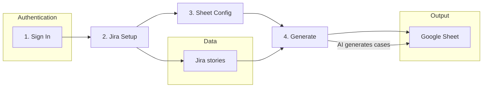

# Test Case Generator

An AI-powered tool that automates test case creation by converting Jira stories into comprehensive, structured test cases and exporting them to Google Sheets.

## Features

- **Multi-AI Support** - Choose from OpenAI, Anthropic Claude, or Google Gemini for intelligent test case generation
- **Jira Integration** - Fetch user stories, epics, and requirements directly from your Jira projects
- **Google Sheets Export** - Automatically write generated test cases to Google Sheets in a structured format
- **OAuth Authentication** - Secure sign-in with Google and Atlassian accounts
- **Step-by-Step Wizard** - Intuitive 4-step workflow for seamless test case generation

## Workflow

The app uses a **4-step wizard**. Below is the end-to-end flow and what happens at each stage.

### User journey (wizard)

| Step | Name | What you do |
|------|------|-------------|
| 1 | **Sign In** | Connect **Google** (Sheets access) and **Atlassian** (Jira access). Both are required before later steps. |
| 2 | **Jira Setup** | Pick a Jira site, project, and filters so the app knows which stories/issues to turn into test cases. |
| 3 | **Sheet Config** | Select an existing Google Sheet or create a new one—this is where generated test cases are written. |
| 4 | **Generate** | Choose an AI provider (OpenAI, Anthropic, or Gemini), optional model, then run generation. Results are appended to your sheet. |

### Flow diagram



### Behind the scenes

1. **OAuth** – Sessions store Google and Atlassian tokens so the backend can call Jira and Google Sheets on your behalf.
2. **Fetch** – Selected Jira issues are retrieved via the Jira REST API.
3. **Generate** – Issue content is sent to the chosen AI; structured test cases are produced from prompts in the backend.
4. **Export** – The backend writes rows to your configured Google Sheet via the Sheets API.

## Tech Stack

### Backend
- **Framework**: FastAPI (Python)
- **Authentication**: OAuth 2.0 (Google, Atlassian)
- **Session Management**: Starlette Sessions

### Frontend
- **Framework**: React 19 with TypeScript
- **Build Tool**: Vite
- **Styling**: Tailwind CSS
- **State Management**: React Query (TanStack Query)
- **UI Components**: Custom components with Lucide icons

### AI Providers
- OpenAI (GPT models)
- Anthropic (Claude models)
- Google Generative AI (Gemini models)

### Integrations
- Jira REST API
- Google Sheets API
- Google OAuth 2.0
- Atlassian OAuth 2.0

## Project Structure

```
TestCaseCreation/
├── app/                    # Backend (FastAPI)
│   ├── api/               # API route handlers
│   │   ├── auth.py        # Authentication endpoints
│   │   ├── generate.py    # Test case generation endpoints
│   │   ├── jira.py        # Jira integration endpoints
│   │   └── sheets.py      # Google Sheets endpoints
│   ├── core/              # Core configuration
│   │   ├── config.py      # Application settings
│   │   ├── constants.py   # AI prompts and constants
│   │   └── endpoints.py   # API endpoint definitions
│   ├── services/          # Business logic
│   │   ├── ai_service.py  # AI provider integrations
│   │   ├── jira_service.py# Jira API service
│   │   └── sheets_service.py # Google Sheets service
│   └── main.py            # FastAPI app entry point
├── frontend/              # Frontend (React + Vite)
│   ├── src/
│   │   ├── components/    # React components
│   │   │   ├── Steps/     # Wizard step components
│   │   │   ├── Stepper/   # Progress stepper
│   │   │   └── ui/        # Reusable UI components
│   │   ├── contexts/      # React contexts
│   │   ├── constants/     # Frontend constants
│   │   ├── lib/           # API client and utilities
│   │   ├── types/         # TypeScript type definitions
│   │   └── App.tsx        # Main application component
│   └── package.json       # Frontend dependencies
├── main.py                # Application entry point
├── requirements.txt       # Python dependencies
└── README.md
```

## Installation

### Prerequisites
- Python 3.10+
- Node.js 18+
- Google Cloud Console project with Sheets API enabled
- Atlassian Developer account for Jira OAuth

### Backend Setup

1. Clone the repository:
   ```bash
   git clone https://github.com/yourusername/TestCaseCreation.git
   cd TestCaseCreation
   ```

2. Create and activate virtual environment:
   ```bash
   python -m venv .venv
   source .venv/bin/activate  # On Windows: .venv\Scripts\activate
   ```

3. Install Python dependencies:
   ```bash
   pip install -r requirements.txt
   ```

4. Create `.env` file with required environment variables:
   ```env
   # Application
   SECRET_KEY=your-secret-key
   DEBUG=true
   
   # Google OAuth
   GOOGLE_CLIENT_ID=your-google-client-id
   GOOGLE_CLIENT_SECRET=your-google-client-secret
   
   # Atlassian OAuth
   ATLASSIAN_CLIENT_ID=your-atlassian-client-id
   ATLASSIAN_CLIENT_SECRET=your-atlassian-client-secret
   
   # AI Providers (add the ones you want to use)
   OPENAI_API_KEY=your-openai-api-key
   ANTHROPIC_API_KEY=your-anthropic-api-key
   GOOGLE_AI_API_KEY=your-google-ai-api-key
   ```

5. Run the backend:
   ```bash
   python main.py
   ```
   The API will be available at `http://localhost:8000`

### Frontend Setup

1. Navigate to frontend directory:
   ```bash
   cd frontend
   ```

2. Install dependencies:
   ```bash
   npm install
   ```

3. Start development server:
   ```bash
   npm run dev
   ```
   The frontend will be available at `http://localhost:5173`

## API Documentation

Once the backend is running, access the interactive API documentation at:
- Swagger UI: `http://localhost:8000/docs`
- ReDoc: `http://localhost:8000/redoc`

## Usage

1. Open the application in your browser (`http://localhost:5173`)
2. Sign in with both Google and Atlassian accounts
3. Select your Jira project and configure filters
4. Choose or create a Google Sheet for output
5. Select your preferred AI provider and model
6. Click "Generate" to create test cases

## Environment Variables

| Variable | Description | Required |
|----------|-------------|----------|
| `SECRET_KEY` | Secret key for session encryption | Yes |
| `GOOGLE_CLIENT_ID` | Google OAuth client ID | Yes |
| `GOOGLE_CLIENT_SECRET` | Google OAuth client secret | Yes |
| `ATLASSIAN_CLIENT_ID` | Atlassian OAuth client ID | Yes |
| `ATLASSIAN_CLIENT_SECRET` | Atlassian OAuth client secret | Yes |
| `OPENAI_API_KEY` | OpenAI API key | Optional |
| `ANTHROPIC_API_KEY` | Anthropic API key | Optional |
| `GOOGLE_AI_API_KEY` | Google Generative AI API key | Optional |

## License

This project is for personal/internal use.

## Creator

**Danish Chaudhary**  
Email: chaudharydanish024@gmail.com

---

Made with passion for QA automation
